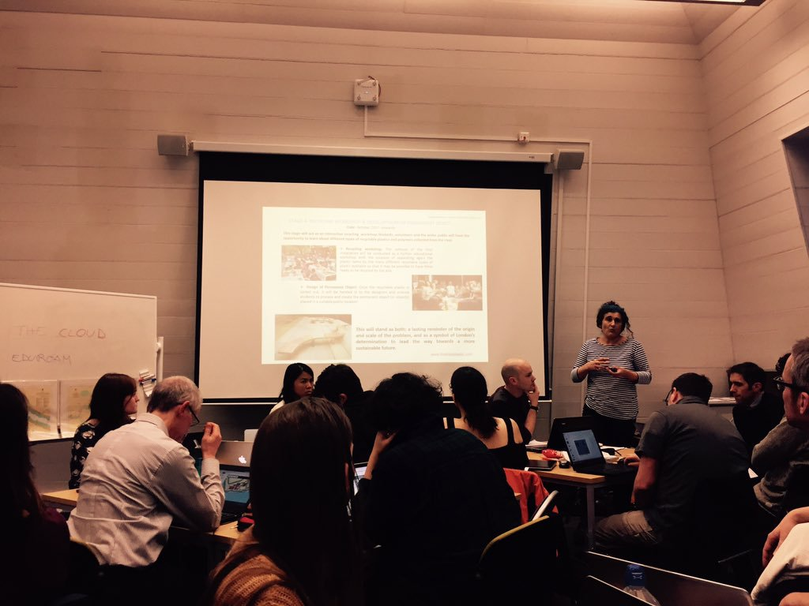
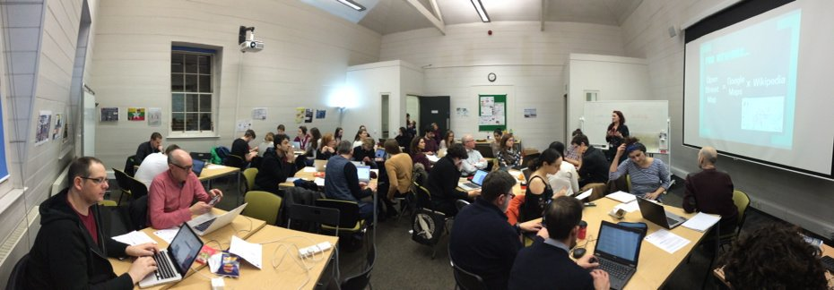
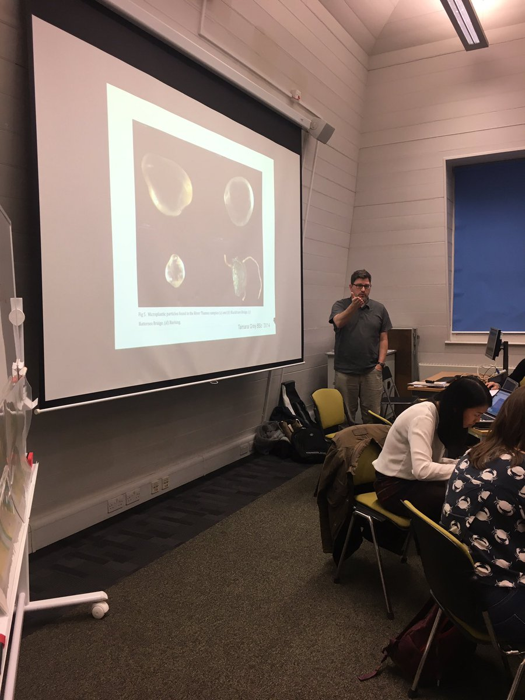

#Thamesplastic Mapathon

Plastic is one of the most notable traces of contemporary society. Its ubitquity in our daily lives, from toothpaste micro-beads to shopping bags, makes it also the culprit of a large portion of environmental pollution. 

Given its high buoyance -among other factors- plastic debris can quickly and easily accumulate in channels and rivers, eventually leading to the sea. Water bodies present in proximity of urban areas are particularly prone to experience such processes, and the Thames river is no exception.

To answer this pressing socio-ecological issue a comprehensive research project [ -*Thames Memory & the Exploration of Future Dust*-](http://www.thamesplastic.com/research) is currently being led by King’s College London Departments of Geography, Chemistry, Informatics in tandem with Thames21 and the Thames Estuary Partnership. Such project  will result in a large temporary art installation created by artist [Maria Arceo.](http://www.mariajosearceo.com/) with the tide of plastic litter collected from Thames's shoreline; a concrete testament exposing the magnitude of the problem.

To support Maria's effort, and in the hope of one day experiencing a cleaner Thames, the [KCL Humanitarian Mappers team](https://twitter.com/KCLMapathons) has gladly hosted an *ad hoc* mapathon on February the 7th to raise awereness on such issue.

During the night of mapping & pizza, more than 40 volunteers traced onto [OpenStreetMap](https://www.openstreetmap.org) the outline of Thames's tidal shores taken from satellite imagery. 
Throughout the evening there have been talks from a range of experts about the creative and scientific aspects of the project, ranging from KCL Geography's own Dr. Michael Chadwick
to members of partners organizations Thames 21 and the Thames Estuary Partnership.

Throughout the event, novel mappers not only have had the chance to strenghten their GIS skills by contributing to an Open-Source initiative (OpenStreetMap); but furthermore have produced a richer map of the Thames beaches that will help KCL artist in residence Maria  to identify where she can collect waste plastics in her year long campaign to collect rubbish along the entire tidal Thames.  All in all, not a bad result for a single evening of mapping!

And what about you? The KCL Humanitarian Mappers team is waiting you at the next event. As always, bring a laptop along (and a computer mouse!). We'll provide pizza and drinks, and a good excuse to map. Beginners most welcome!

*Faith, James and Michele*

